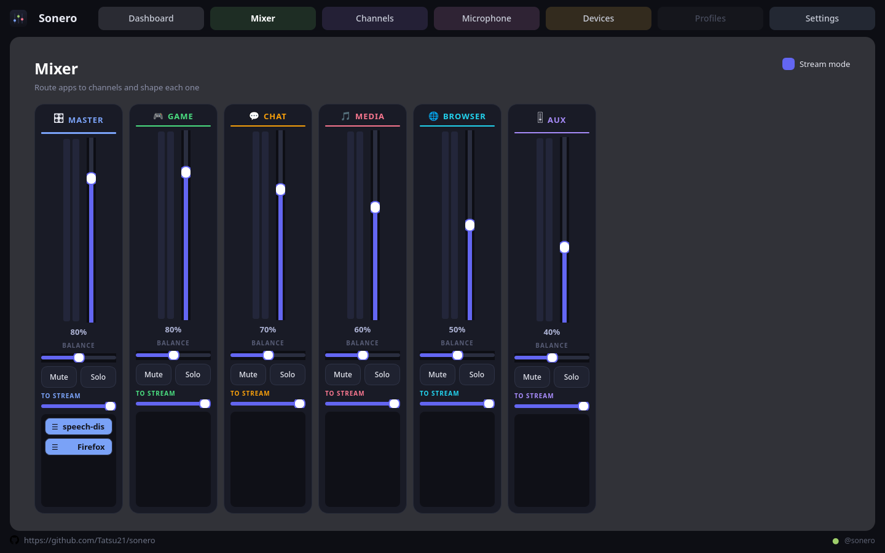
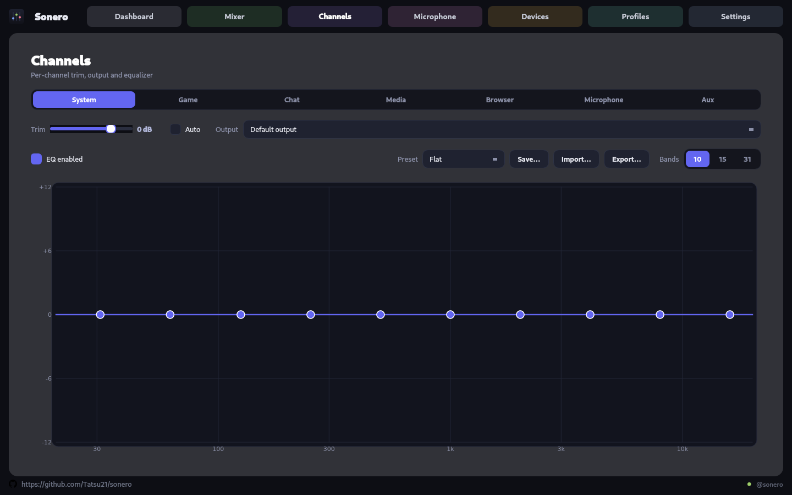

<div align="center">


# Sonero

**The audio control center Linux never had.**

Per-application mixing, routing, equalization and device control — for *any*
sound hardware you own, built directly on PipeWire.
No PulseAudio shims, no Wine, no vendor lock-in.

<sub>SteelSeries Sonar was the inspiration. Sonero is not a clone of it:
it is not tied to one brand's headset, and it works with every output PipeWire
can see.</sub>

[](https://github.com/Tatsu21/sonero/actions/workflows/ci.yml)
[](LICENSE)




</div>

---

## What it does

Sonero creates a set of **virtual sound cards** on PipeWire and lets you send each
application to whichever one you like. Your game, your Discord call, your music and
your browser then get their own volume, their own equalizer and their own output
device — live, without restarting anything.

Where a vendor tool stops at that vendor's headset, Sonero treats **every output as a
first-class device**: USB interfaces, Bluetooth headphones, HDMI, S/PDIF and onboard
analog outputs are all detected, badged and routable the same way, each with its own
transmission format — sample rate and bit depth for wired devices, codec for
Bluetooth — and battery wherever the hardware reports one. Two channels can even play
to two different devices at once.

|  | Feature |
|---|---|
| 🎚️ | **Six output channels** — Master (System), Game, Chat, Media, Browser, Aux. Volume, mute, solo, balance and live VU meters per channel. |
| 🧲 | **Drag-free app routing** — every playing app shows up as a chip; move it to a channel and it stays there across restarts. |
| 🎛️ | **Equalizer per channel** in 10, 15 or 31 bands, with 20+ built-in presets (music, gaming, voice, movie) plus save / import / export of your own. |
| 🔊 | **Per-channel gain, set automatically on request** — it holds the highest gain (up to +6 dB) that keeps the channel's real output clear of full scale: quiet material climbs, a peak that overshoots is taken back by exactly what it overshot. Slow up, immediate down, so nothing breathes. |
| 🎥 | **Streaming mix for OBS** — a `Sonero Stream` input source with an independent send level per channel, so your viewers hear a different balance than you do. |
| 🎤 | **Virtual microphone** with input gain, mute and level metering; it appears to apps as a normal source. |
| 🎧 | **Any output device** — USB, Bluetooth, HDMI, S/PDIF and analog, each detected and badged automatically, each with its own output selection per channel. |
| 💿 | **Per-device transmission format** — sample rate and bit depth up to 24-bit / 96 kHz, written as a per-device WirePlumber drop-in, so changing one device never disturbs the others. |
| 📶 | **Bluetooth done properly** — automatic switch to the best A2DP codec the headset offers, ranked from LDAC (untested — see below) and aptX down to SBC, plus battery level through BlueZ. |
| 🔋 | **SteelSeries headsets** — battery read straight from the base station over USB HID (Arctis Nova Pro Wireless and relatives), on top of everything above. |
| 💾 | **Everything persists** — first launch gives you sane defaults; every change you make is remembered for the next session. |
| 🖥️ | **A real desktop app** — tray icon, desktop notifications, autostart at login and background operation so your channels stay alive when the window is closed. |

<details>
<summary><b>Not there yet</b></summary>

- **Profiles** page — saving whole configurations as named profiles is stubbed out.
- **Microphone DSP** — noise suppression, gate and monitoring are laid out in the UI and marked `PREPARED`; the DSP behind them is not wired.
- **SteelSeries hardware EQ** — the HID writes succeed but produce no audible change on the tested dock; treat it as unsupported.

</details>

---

## Why this exists

I built Sonero for two reasons, and neither of them is money.

The first is that I wanted to **learn**. Building it meant working with PipeWire's
module system, biquad filters, Qt6, USB HID and Debian packaging — things I had read
about but never actually used.

The second is that I wanted **to use it**. This is the tool I run on my own machine
every day; every feature exists because something annoyed me first. That is also why
there is no telemetry, no account, no "pro" tier and nothing that phones home — the
app opens a single local socket so a second launch reuses the running window, and
that is the whole of its networking.

It is not a commercial product and it is not trying to become one. It is a personal
project, released openly in the hope that it is **useful to someone else too** — if
you have a headset, a Linux desktop and the same frustration, take it, change it, or
tell me what broke. Bug reports and pull requests are welcome; just keep in mind it
is built in spare time, by one person, and it will move at that pace.

---

## Install

### Debian, Ubuntu, Linux Mint — the `.deb`

The best experience: apt pulls in Qt for you, and the package installs the udev rule
that grants SteelSeries HID access, so headset battery works with no extra steps.

```sh
sudo apt install ./sonero_0.1.1_amd64.deb
```

Grab a package from **[Actions → the latest CI run → Artifacts](https://github.com/Tatsu21/sonero/actions)**,
matching your base:

| Artifact | For |
|---|---|
| `Sonero-mint21-ubuntu2204` | Ubuntu 22.04, Linux Mint 21.x |
| `Sonero-mint22-ubuntu2404` | Ubuntu 24.04, Linux Mint 22.x |

> A `.deb` links against the distribution's own Qt, so one built on Ubuntu 24.04 will
> not install on Mint 21. Build for another target with
> `./packaging/deb/build-deb-docker.sh ubuntu:22.04` — see [docs/INSTALL.md](docs/INSTALL.md).

### Arch, Fedora, openSUSE, anything else — the AppImage

One portable file that carries its own Qt. Nothing is written outside your home
directory unless you explicitly approve it.

```sh
chmod +x Sonero-*-x86_64.AppImage
./Sonero-*-x86_64.AppImage
```

On first run it adds itself to your application menu. It needs FUSE 2
(`libfuse2` / `fuse2`), or run it with `--appimage-extract-and-run`.

The AppImage is a CI artifact too, or build one yourself:

```sh
./packaging/appimage/build-appimage.sh dist
```

### Or build from source

See [Building](#building) below — the recommended route on Arch and Fedora, where
compiling against the system Qt is quick and leaves you with a small binary that
follows your distribution's own Qt updates instead of freezing a copy of them.

---

## Requirements

| | Minimum | Notes |
|---|---|---|
| **PipeWire** | 0.3 | Plus WirePlumber as the session manager. Already running on every current desktop. |
| **Qt** | 6.2 | Widgets, D-Bus and Network modules. |
| **CPU** | x86-64 | Nothing exotic; the DSP is a handful of biquads per channel. |

PipeWire is a *recommended*, not a hard, dependency of the `.deb` — installing Sonero
will never drag in an audio server you did not ask for.

---

## Device support

If PipeWire can see it, Sonero can route to it. Detection is automatic; the extras
depend on what the hardware exposes.

| Device class | Routing | Format control | Battery |
|---|---|---|---|
| USB headsets, DACs and interfaces | ✅ | rate + bit depth | — |
| Bluetooth headphones and speakers | ✅ | codec selection | ✅ via BlueZ |
| SteelSeries wireless (Arctis Nova Pro & relatives) | ✅ | rate + bit depth | ✅ direct over USB HID |
| HDMI / DisplayPort outputs | ✅ | rate + bit depth | — |
| S/PDIF and optical | ✅ | rate + bit depth | — |
| Onboard analog | ✅ | rate + bit depth | — |

No device is privileged over another, and each channel picks its own output — send
Chat to your headset while Media keeps playing on the speakers.

Two honest caveats about format control: a rate is only honoured up to what the
hardware advertises (ask a 48 kHz headset for 96 kHz and ALSA clamps it back), and
because ALSA fixes the format when the PCM is opened, a change lands the next time
WirePlumber loads its config — Sonero will not restart it behind your back, since
that would drop every Bluetooth link.

### Tested hardware

The headsets I have on hand, and therefore the ones Sonero has been tested against:

| Device | Connection | Notes |
|---|---|---|
| **SteelSeries Arctis Nova Pro Wireless** | USB base station | Battery is read directly from the dock over USB HID. |
| **Sennheiser MOMENTUM 4 Wireless** | Bluetooth, and wired over USB | |
| **Sony WH-CH720N** | Bluetooth | |

Nothing else is excluded — detection is generic, so any output PipeWire exposes should
work the same way. These three are simply the ones I can vouch for.

**LDAC is untested.** The codec picker ranks whatever A2DP profiles BlueZ reports and
puts LDAC at the top of that ranking, but none of the headsets above offers it, so that
path has never run on real hardware. Note also that which codecs you are offered at all
depends on how your distribution built PipeWire: SBC is always there, while AAC, aptX,
aptX HD and LDAC appear only when the matching encoder libraries were compiled in.

### Adding your own headset — without reading the code

Battery level goes over USB HID, and that protocol differs per model, so only the Arctis
Nova Pro Wireless is implemented. Everything else still plays audio normally — it is
only the percentage that is model-specific.

If you want yours supported and you do not write C++, you do not have to.
[`hid/SKILL.md`](hid/SKILL.md) is a written procedure meant to be handed to an **AI
assistant** — Claude Code, or any model that can read a repository — so it can do the
work for you: identifying the device, granting it access, sourcing the protocol from an
existing implementation, writing a new device class beside the existing one, and proving
the result is real instead of merely plausible. In Claude Code it is registered as a
skill, so `/add-hid-headset` starts it.

It deliberately stops at battery level. Sonero can also write an equalizer to the
Arctis's onboard DSP — the device accepts the write and nothing audible changes, and
that is unsolved — so the procedure tells an assistant not to attempt onboard EQ,
sidetone or ANC for a new model. There is no working example to copy, and no way to tell
a correct implementation from a broken one.

Your part is the half no assistant can do: plug the headset in, turn it off and on when
asked, and say whether the number it produces matches what your headset really reports.
If it works, send a pull request. See [docs/INSTALL.md](docs/INSTALL.md) for the same
thing at more length.

---

## Building

Sonero is a plain CMake project. Install the dependencies for your distribution, then
run the same three commands everywhere.

#### Debian · Ubuntu · Mint

```sh
sudo apt install build-essential cmake ninja-build pkg-config dpkg-dev \
    qt6-base-dev qt6-base-dev-tools qt6-wayland qt6-wayland-dev \
    libpipewire-0.3-dev libgl-dev libegl-dev
```

`libgl-dev` and `libegl-dev` matter: Qt6's CMake config needs them, and
`--no-install-recommends` will otherwise skip them. `libspdlog-dev` is optional.

#### Arch · Manjaro · EndeavourOS

```sh
sudo pacman -S --needed base-devel cmake ninja qt6-base qt6-wayland pipewire
```

Arch ships headers in the main packages, so there is no `-dev` split — `pipewire`
already provides `libpipewire-0.3.pc`. Add `spdlog` for richer logs.

#### Fedora · RHEL · Nobara

```sh
sudo dnf install gcc-c++ cmake ninja-build pkgconf-pkg-config \
    qt6-qtbase-devel qt6-qtwayland-devel pipewire-devel
```

`qt6-qtbase-devel` pulls in the Mesa GL/EGL development packages Qt6 needs.
Add `spdlog-devel` for richer logs.

#### openSUSE Tumbleweed · Leap

```sh
sudo zypper install gcc-c++ cmake ninja pkgconf-pkg-config \
    qt6-base-devel qt6-wayland-devel pipewire-devel
```

#### Then, on any of them

```sh
cmake -S . -B build -G Ninja -DCMAKE_BUILD_TYPE=Release
cmake --build build --parallel
./build/Sonero
```

Run the test suite (nine suites, QtTest, no audio hardware required):

```sh
ctest --test-dir build --output-on-failure
```

<details>
<summary><b>Installing system-wide from source</b></summary>

```sh
cmake -S . -B build -G Ninja -DCMAKE_BUILD_TYPE=Release -DCMAKE_INSTALL_PREFIX=/usr
cmake --build build --parallel
sudo cmake --install build
```

This places the binary, desktop entry, icons and the SteelSeries udev rule under
`/usr`. If you install to `/usr/local` instead, udev may not read the rule from
there — install it from **Settings → System integration** inside the app, which shows
you the exact commands before running them.

</details>

<details>
<summary><b>Build options</b></summary>

| Option | Default | Effect |
|---|---|---|
| `SONAR_USE_SPDLOG` | `ON` | Log through spdlog when it is installed. Packaged builds set `OFF`: spdlog's Debian package name encodes both its own and libfmt's ABI version, which exists on no other distribution. The built-in logger costs nothing. |
| `BUILD_TESTING` | `ON` | Build the QtTest suites. |
| `CMAKE_BUILD_TYPE` | `RelWithDebInfo` | Set explicitly for release builds. |

</details>

> **A note on CI coverage:** the pipeline builds and tests on Ubuntu 22.04 and 24.04.
> The Arch, Fedora and openSUSE dependency lists are the standard equivalents and are
> verified by contributors rather than by CI — open an issue if a package name drifts.

---

## Hardware features that need permission

Two optional capabilities touch system files. Open **Settings → System integration**:
each row shows its state, and clicking *Set up…* prints the exact commands before your
desktop asks for a password. Nothing runs if you cancel.

- **SteelSeries headset access** — installs a udev rule granting your user access to
  SteelSeries HID devices only, so battery level can be read from `/dev/hidraw*`.
- **Bluetooth battery reporting** — BlueZ only exposes battery level with its
  experimental interfaces on; the fix adds a systemd drop-in rather than editing your
  distribution's own unit.

Both are reversible by deleting a single file. Details in [docs/INSTALL.md](docs/INSTALL.md).

---

## Where your settings live

```
~/.config/Sonero/Sonero/settings.json   mixer, EQ, routing, preferences
~/.config/Sonero/Sonero/presets/        saved equalizer presets
```

Delete that directory to return to factory defaults.

---

## Architecture

Sonero keeps the audio engine free of Qt, so it can be tested headlessly and reused.

```
sonero/
├── app/       Composition root: main, Application, single-instance guard, autostart
├── ui/        Qt6 Widgets — pages (Mixer, Channels, Microphone, Devices, Settings)
│   └── widgets/   ChannelStrip, AppChip, EqCurve, VuMeter
├── audio/     Backend interfaces + PipeWireManager, Mixer, device formats
├── dsp/       Equalizer (biquad cascade) and AutoGain
├── hid/       SteelSeries base-station protocol over hidraw
├── core/      Logging and a std::format stand-in for older toolchains
├── config/    Debounced JSON settings store
├── packaging/ .deb, AppImage, icons, udev rules
├── docs/      Install guide and notes
└── tests/     QtTest suites
```

**How the audio path works.** Every channel is a `module-filter-chain` instance whose
capture side is a virtual `Audio/Sink` and whose graph is a cascade of 31 peaking
biquads — the equalizer. A `module-loopback` then carries that chain's output to the
device you picked, and a second loopback taps the same sink at its own send level to
feed the `Sonero Stream` source that OBS records. Applications move between channels
by rewriting their `target.object` metadata, which PipeWire applies without
interrupting playback. Gain staging is deliberate: volume × channel gain × EQ
headroom × a fixed filter reserve, so a boosted band cannot clip on the way to the
device.

<div align="center">

</div>

---

## Development

```sh
cmake -S . -B build -G Ninja -DCMAKE_BUILD_TYPE=RelWithDebInfo
cmake --build build --parallel
ctest --test-dir build --output-on-failure
```

- `SONAR_PAGE=<n>` opens the app straight on a page, so a UI change can be checked
  without clicking through to it.
- `./build/hidprobe` dumps the SteelSeries base-station HID conversation.
- The project targets GCC 11 and up. `core/Format` exists precisely because
  `std::format` is not available there, and packaged builds must run on distributions
  whose libstdc++ predates it.

---

## How this was built

I wrote Sonero with **AI assistance** — Anthropic's Claude, used as a pair programmer
through Claude Code. A large share of the C++ was drafted in that conversation:
PipeWire module wiring, the biquad equalizer and auto-gain, the Qt widgets, the
packaging scripts and the test suites.

What the AI did not do is decide anything on its own. Every feature started as
something I asked for, every change was read before it was kept, and the parts that
matter — gain staging, EQ headroom, the SteelSeries HID protocol, Bluetooth codec
behaviour — were checked against real hardware and real recordings rather than
against a model's confidence. Several early versions of the auto-gain and the
equalizer were wrong in ways only listening could reveal, and they were rewritten
until they were not. Learning to tell those two situations apart was a good part of
the point.

I am saying this openly because the project is open: you should know how it was made.
The code is the same code either way — read it, test it, and judge it on its own
terms.

---

## License

[MIT](LICENSE) — do what you like with it, including commercially; just keep the
copyright notice. Copyright © 2026 Luci ([@Tatsu21](https://github.com/Tatsu21)).

### Third-party components

| Component | License | How it is used |
|---|---|---|
| [Qt 6](https://www.qt.io/) | LGPL-3.0 | Dynamically linked. The AppImage ships Qt's shared libraries unmodified, which LGPL-3.0 permits; the `.deb` uses your distribution's Qt. |
| [PipeWire](https://pipewire.org/) | MIT | Dynamically linked, never bundled — Sonero always talks to the PipeWire already running on your system. |
| [spdlog](https://github.com/gabime/spdlog) | MIT | Optional at build time. Packaged builds leave it out and use the built-in logger. |

Icons and artwork under `packaging/icons/` are original work and fall under the same
MIT license as the rest of the project.

### On the name

SteelSeries Sonar showed what a per-application mixer should feel like, and Sonero
takes that idea further: no vendor requirement, every PipeWire device treated equally,
and the whole audio path open to read. Sonero shares no code with it and is not
affiliated with, endorsed by, or derived from SteelSeries; "Sonar" is a trademark of
its respective owner, named here only to credit the inspiration.
